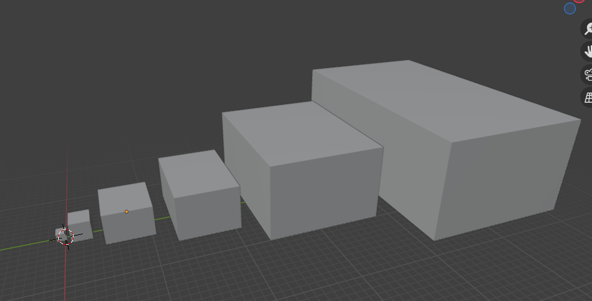

# Starship Size Classification

## Shuttle

Width: 12m
Length: 15m
Height: 10m

## Small

Width: 25m
Length: 30m
Height: 25m

## Medium

Width: 60m
Length: 70m
Height: 40m

## Large

Width: 80m
Length: 120m
Height: 60m

## Sub-Capital

Width: 150m
Length: 200m
Height: 100m

## Capital

Width: 200m
Length: 350m
Height: 130m

*and larger* 